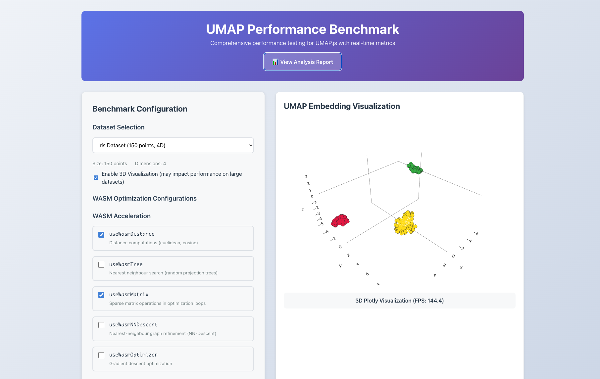

# umap-bench

Minimal Vite + React + TypeScript benchmark app for experimenting with [umap-wasm](https://github.com/elarsaks/umap-wasm) implementations.

**[Live site](https://elarsaks.github.io/umap-bench/)** · **[Analysis](https://elarsaks.github.io/umap-bench/analysis.html)**



## Features

- **Dataset Selection** - Choose from various pre-configured datasets or generate custom synthetic data
- **UMAP Configuration** - Adjust n_neighbors, min_dist, n_components, spread, and learning rate parameters
- **Release Selection** - Select different umap-wasm releases directly from the UI to compare performance
- **Performance Metrics** - Track execution time, memory usage, embedding quality, FPS, and responsiveness
- **Visualization** - Interactive 3D visualization of UMAP embeddings using Plotly

## Quick start

```bash
yarn install
yarn dev
```

Open the dev server at: http://localhost:5173

## Prerequisites

- Node.js 22+
- npm or yarn
- uv (for Python notebook environments)

## Environment setup

### Install dependencies

```bash
yarn install
```

### Set up Python notebooks

The preprocessing and analysis notebooks use a `uv`-managed Python environment defined in `pyproject.toml`.

Install `uv` if needed:
```bash
# macOS
brew install uv

# Or with the standalone installer
curl -LsSf https://astral.sh/uv/install.sh | sh
```

Create/update the local Python environment:
```bash
uv sync
```

Register the notebook kernel:
```bash
uv run python -m ipykernel install --sys-prefix \
  --name umap-bench \
  --display-name "Python (umap-bench)"
```

Run Jupyter from the notebook folder so relative input/output paths resolve correctly:
```bash
cd bench/analysis
uv run jupyter notebook
```

In the notebook UI, open `preprocess.ipynb` or `analysis.ipynb` and select the `Python (umap-bench)` kernel.

### Install Playwright browsers

- macOS / Windows
	```bash
	yarn playwright install chromium
	```
- Linux / WSL (adds required system libs; Ubuntu 24.04 uses *t64* packages)
	```bash
	sudo apt update
	sudo apt install -y libnspr4 libnss3 libxss1 libasound2t64 libatk1.0-0t64 libatk-bridge2.0-0t64 \
		libcups2t64 libx11-xcb1 libxcb1 libxcomposite1 libxrandr2 libxrender1 libxfixes3 \
		libxtst6 libgbm1 libgtk-3-0t64 libpangocairo-1.0-0 libdbus-1-3
	yarn playwright install --with-deps chromium
	```

If Chromium still fails to launch, run `ldd $(yarn playwright install chromium --dry-run | tail -n 1)` and install any libraries marked "not found".

## Development

```bash
yarn build    # production build
yarn preview  # preview production build locally
```

## Testing

### Unit Tests (Application Logic)

Tests for utilities, components, and business logic using Vitest.

Located in: `src/test/`

- Quick run
	```bash
	yarn test
	```
- Watch mode
	```bash
	yarn test:watch
	```
- Coverage report
	```bash
	yarn test:coverage
	```
- UI runner
	```bash
	yarn test:ui
	```

### Performance Benchmarks (Experimental)

Playwright-based tests for measuring UMAP implementation performance across different releases and datasets.

**Note on Visualization**:
- Automated benchmarks run with 3D visualization disabled by default for consistent performance measurement
- When running the app interactively (`yarn dev`), use the "Enable 3D Visualization" checkbox to toggle rendering
- Disabling visualization significantly improves benchmark speed (20-50% faster), especially for mid/large scopes
- **New larger datasets** (5K-10K points) are now available and recommended to run with rendering disabled
- FPS values in automated test results will be 0 when rendering is disabled

Located in: `bench/`

- Headless benchmark suite
	```bash
	yarn bench
	```
- Run benchmark suite N times and record machine specs (default 10)
	```bash
	yarn bench:loop
	# or customize
	yarn bench:loop --runs=5
	yarn bench:loop --scope=small
	yarn bench:loop --scope=small --runs=3 --wasm=all
	```

- **Complete thesis dataset** (all scopes × all WASM configs × N runs)
	```bash
	# Recommended: Full automated suite for thesis data
	yarn bench:full

	# Or custom: Run all combinations with specific run count
	RUNS=10 bash -lc 'set -e; runs="${RUNS}"; for scope in small mid large; do for wasm in none all dist tree matrix nn opt; do if [ "$wasm" = "none" ]; then yarn bench:loop --scope="$scope" --runs="$runs"; else yarn bench:loop --scope="$scope" --runs="$runs" --wasm="$wasm"; fi; done; done'
	```
	This generates: 3 scopes × 7 configurations × 2 datasets × 10 runs = **420 benchmark runs**

	Estimated time: 4-7 hours (depends on machine)

**Dataset Scopes:**
- **`small`**: Lightweight datasets for quick validation (150, 80 points)
  - Iris Dataset (150 points, 4D)
  - Small Random (80 points, 10D)
- **`mid`**: Moderate datasets for typical use cases (600 points)
  - Swiss Roll (600 points, 3D manifold)
  - Medium Clustered (600 points, 50D)
- **`large`**: Large datasets for stress testing (1,000 points)
  - MNIST-like (1,000 points, 784D)
  - 3D Dense Clusters (1,000 points, 75D)

**WASM Configurations:**
- `none` - Pure JavaScript (baseline)
- `dist` - Distance calculations only
- `tree` - KD-tree operations only
- `matrix` - Matrix operations only
- `nn` - Nearest neighbor descent only
- `opt` - Optimizer only
- `all` - All WASM features enabled

**Additional Datasets** (available in interactive mode):
- Spiral (1K points, 20D)
- Large Swiss Roll (2K points, 3D)
- Large Clustered (5K points, 100D)
- Very Large Random (10K points, 50D)
- MNIST-scale (10K points, 784D)

*Tip: Disable 3D visualization for faster benchmarking on datasets with 2K+ points*

### Advanced Options

**WASM Preloading:**
```bash
yarn bench:loop --preload-wasm      # Default: enabled
yarn bench:loop --no-preload-wasm   # Disable preloading
```

**Individual scope/config testing:**
```bash
# Single scope, single config
yarn bench:loop --scope=small --runs=10 --wasm=dist

# Single scope, all configs
RUNS=10 SCOPE=small bash -lc 'set -e; scope="${SCOPE}"; runs="${RUNS}"; for wasm in none all dist tree matrix nn opt; do if [ "$wasm" = "none" ]; then yarn bench:loop --scope="$scope" --runs="$runs"; else yarn bench:loop --scope="$scope" --runs="$runs" --wasm="$wasm"; fi; done'
```

### Results

Performance tests include smoke checks and performance measurements. Results are saved to `bench/results/` with machine specifications for cross-machine comparison.

**After benchmarking**, preprocess results for analysis:
```bash
cd bench/analysis
uv run jupyter notebook preprocess.ipynb
# Converts JSON to preprocessed.csv
```

Note: Playwright writes machine-readable JSON results to `bench/results/` and removes the `playwright-report/` folder to avoid clutter. If you want the HTML report, run Playwright with the `html` reporter or remove the cleanup in `scripts/run-benchmarks.cjs`.

## Notebook automation

- **Convert analysis notebook to HTML**: A script is provided to convert the analysis notebook to HTML and place it in the `public/` folder so it can be served with the site.

Make sure the Python notebook environment exists first:
```bash
uv sync
```

Run manually:
```bash
yarn notebook:convert
```

This script is invoked automatically as part of the `prebuild` step so `public/analysis.html` is refreshed before `yarn build`.

Execute the full analysis notebook from the command line:
```bash
cd bench/analysis
uv run jupyter nbconvert \
  --to notebook \
  --execute analysis.ipynb \
  --output /tmp/analysis_executed.ipynb \
  --ExecutePreprocessor.timeout=900
```
