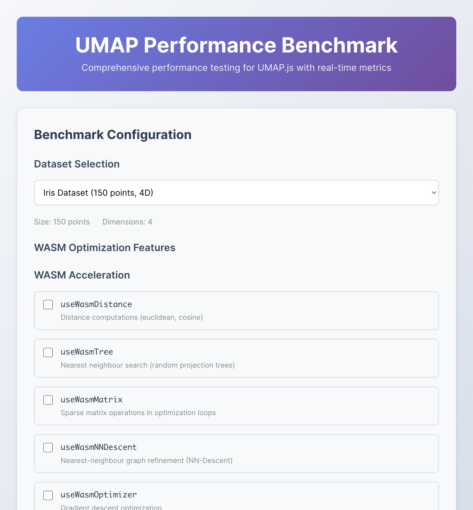
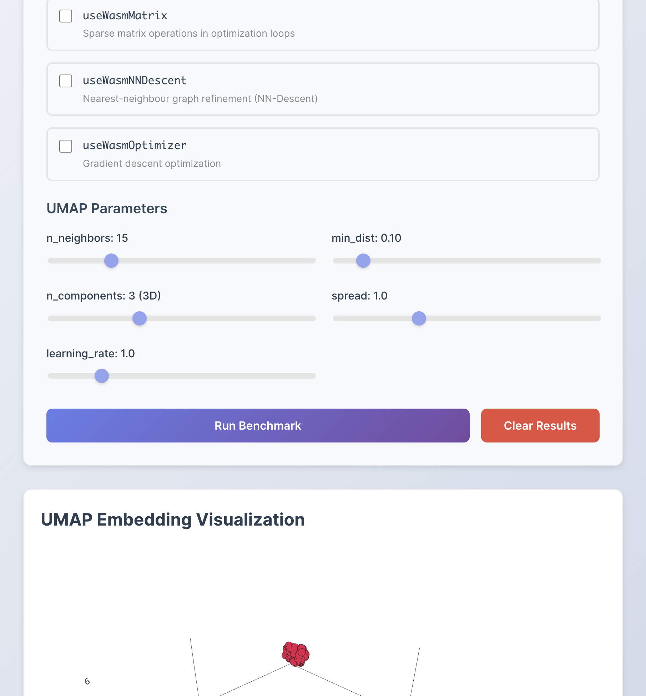
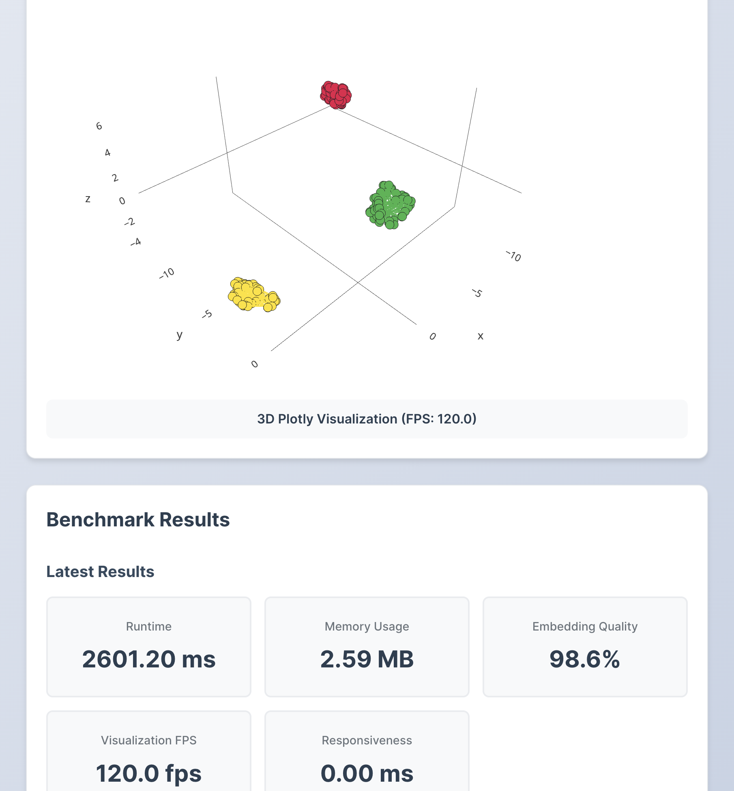
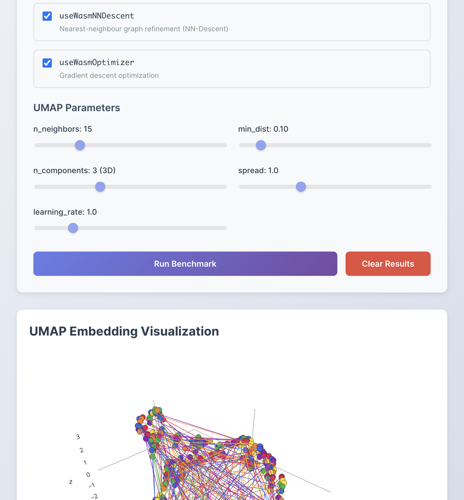
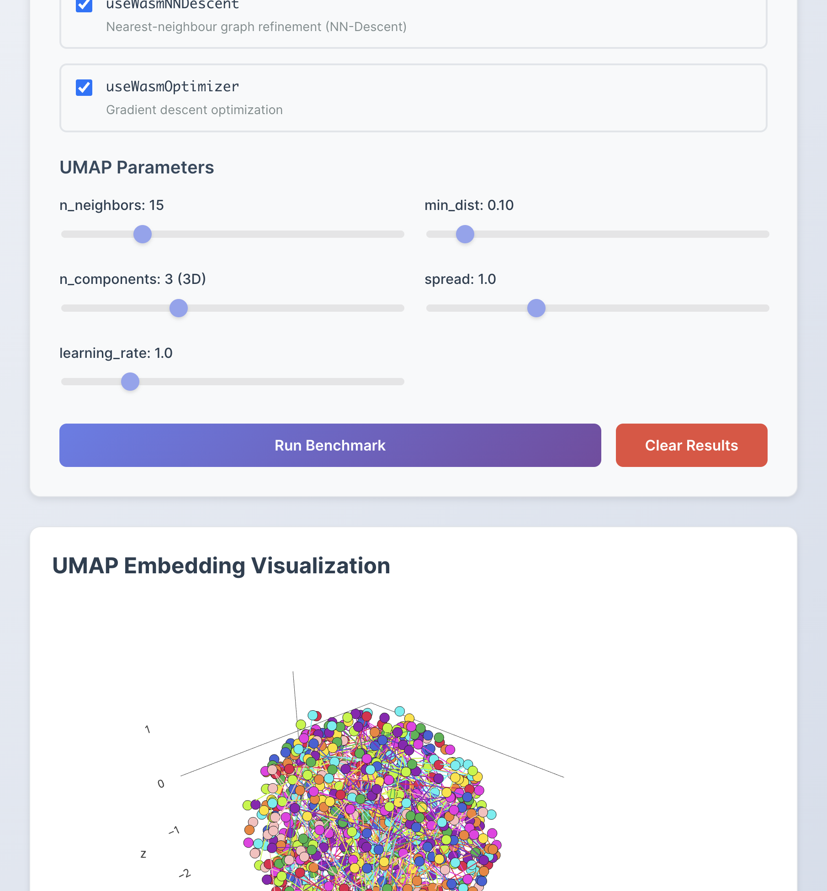
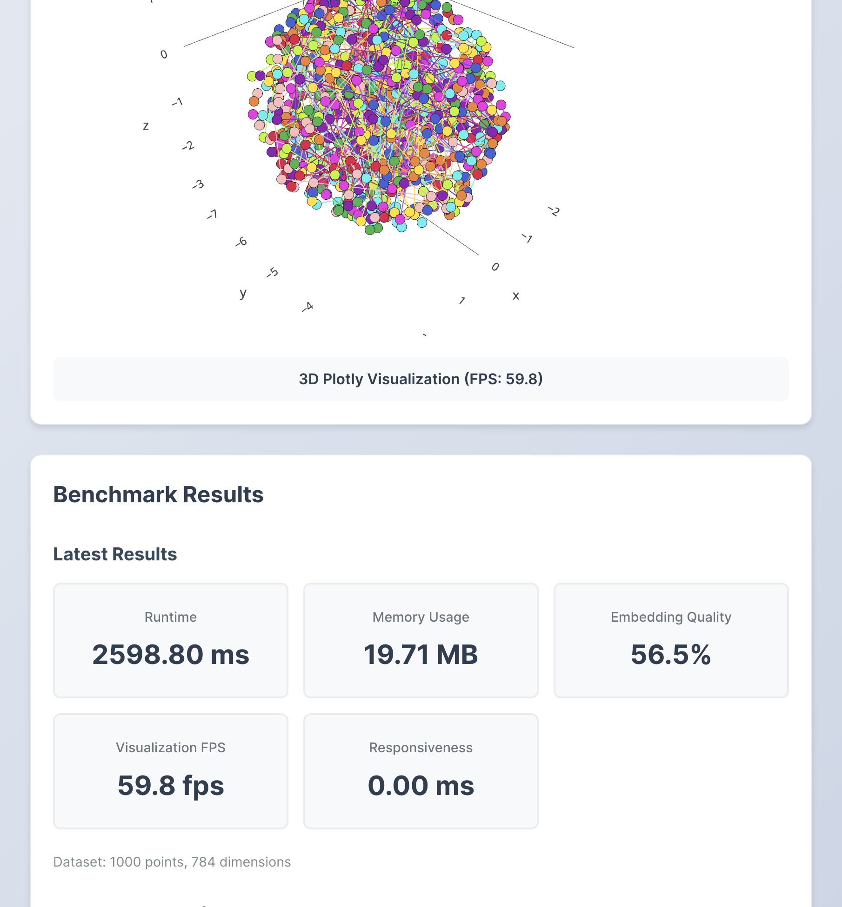

# UMAP Benchmark Screenshots

This directory contains screenshots and results from UMAP performance benchmarking tests.

## Quick Links

📊 **[View Complete Results Summary](./BENCHMARK_RESULTS_SUMMARY.md)**

## Screenshot Index

### Test 1: Iris Dataset (150 points, 4D)
-  - Application initial state
-  - Iris dataset visualization
-  - Performance metrics: 2601ms, 98.6% quality

### Test 2: Swiss Roll (600 points, 3D manifold)
-  - Swiss roll manifold visualization
-  - Performance metrics: 1261ms, 99.4% quality

### Test 3: MNIST-like (1000 points, 784D)
-  - High-dimensional data embedding
-  - Performance metrics: 2599ms, 56.5% quality

## Summary Stats

| Dataset | Runtime | Memory | Quality | FPS |
|---------|---------|--------|---------|-----|
| Iris (150pts, 4D) | 2.6s | 2.59MB | 98.6% | 120fps |
| Swiss Roll (600pts, 3D) | 1.3s | 9.13MB | 99.4% | 92fps |
| MNIST-like (1K pts, 784D) | 2.6s | 19.71MB | 56.5% | 60fps |

## Test Environment

- **Date:** February 1, 2026
- **OS:** macOS (darwin 25.2.0)
- **Node.js:** v22.22.0
- **Browser:** Chromium (Playwright)
- **WASM:** All features enabled

---

Generated by Cursor AI Agent
